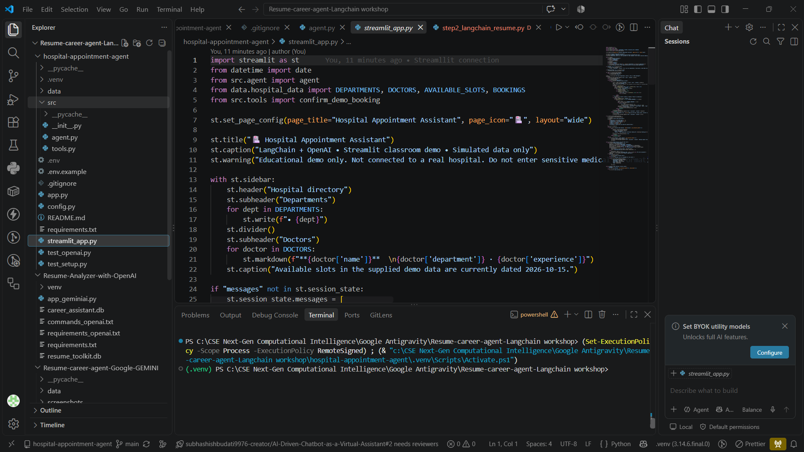

# 🏥 Hospital Appointment Assistant — LangChain + OpenAI

> **AI-powered hospital appointment assistant built as a LangChain + OpenAI + Streamlit classroom/workshop project.**

The **Hospital Appointment Assistant** is an AI-powered conversational application that helps users explore hospital departments, doctors, available appointment slots, and confirm appointments through a structured agent workflow.

The project was developed as part of a **LangChain / OpenAI workshop**, with a focus on understanding how LLMs can interact with application tools and structured data instead of simply generating text.

---

## 📸 Application Preview

<p align="center">
  
</p>

---

## 🎯 Project Overview

The goal of this project was to build a practical AI assistant capable of handling a hospital appointment workflow through natural language.

Instead of requiring the user to manually navigate through multiple menus, the assistant can understand requests such as:

- Finding available hospital departments
- Finding doctors by department
- Checking available appointment slots
- Understanding appointment-related questions
- Confirming a demo appointment through an application tool

The application combines **LangChain agents, OpenAI models, Python tools, structured data, and Streamlit** into a single interactive workflow.

---

## ✨ Features

- 🤖 **AI Conversational Assistant**
- 🏥 **Hospital Department Directory**
- 👨‍⚕️ **Doctor Information**
- 📅 **Appointment Slot Discovery**
- ✅ **Appointment Confirmation Workflow**
- 🔧 **Tool-based Agent Execution**
- 💬 **Natural Language Interaction**
- 🖥️ **Streamlit Web Interface**
- 📦 **Structured Demo Data**
- 🔐 **Environment-based API Configuration**

---

## 🧠 How the AI Agent Works

The application follows a tool-augmented LLM architecture.<br>

```text
                     ┌──────────────────────┐
                     │        User          │
                     │ "I need a doctor     │
                     │  for cardiology"     │
                     └──────────┬───────────┘
                                │
                                ▼
                     ┌──────────────────────┐
                     │   Streamlit UI       │
                     └──────────┬───────────┘
                                │
                                ▼
                     ┌──────────────────────┐
                     │   LangChain Agent    │
                     │                      │
                     │ Understand Request   │
                     │ Decide Required Tool │
                     └──────────┬───────────┘
                                │
              ┌─────────────────┼─────────────────┐
              │                 │                 │
              ▼                 ▼                 ▼
       ┌────────────┐    ┌────────────┐    ┌────────────┐
       │ Departments│    │  Doctors   │    │ Appointment│
       │    Data    │    │    Data    │    │    Tools   │
       └────────────┘    └────────────┘    └────────────┘
                                │
                                ▼
                     ┌──────────────────────┐
                     │     Agent Response   │
                     │ Natural-language     │
                     │ appointment guidance │
                     └──────────────────────┘
```

The LLM determines what the user is asking and uses the available application tools when additional structured information is required.
## 🏗️ Project Structure

hospital-appointment-agent/
│<br>
├── data/<br>
│   └── hospital_data.py<br>
│<br>
├── src/<br>
│   ├── __init__.py<br>
│   ├── agent.py<br>
│   └── tools.py<br>
│<br>
├── screenshots/<br>
│   └── hospital-appointment-assistant.png<br>
│<br>
├── .env<br>
├── .env.example<br>
├── .gitignore<br>
├── app.py<br>
├── config.py<br>
├── README.md<br>
├── requirements.txt<br>
├── streamlit_app.py<br>
├── test_openai.py<br>
└── test_setup.py<br>

## 🔧 Core Components
src/agent.py
Contains the main LangChain agent logic responsible for:
- Connecting the LLM
- Understanding user requests
- Selecting appropriate tools
- Executing tool calls
- Returning the final response
src/tools.py
Contains the application tools used by the agent.
The tools provide the agent with access to structured hospital functionality such as:
- Department lookup
- Doctor lookup
- Appointment slot lookup
- Appointment confirmation
This allows the LLM to interact with application logic instead of relying only on generated knowledge.
data/hospital_data.py
Contains the simulated hospital data used by the application.
The dataset includes information such as:
- Departments
- Doctors
- Doctor specialties
- Experience
- Available appointment slots
- Demo bookings
streamlit_app.py
Provides the interactive Streamlit interface.
The UI includes:
- Hospital directory
- Department information
- Doctor information
- Appointment assistant
- Conversational interaction
- Demo appointment workflow
## 🖥️ Streamlit Interface
The application provides a simple interface around the LangChain agent.
The sidebar exposes the available hospital information while the main interface allows the user to interact with the AI assistant.<br>

┌────────────────────────────────────────────────────┐<br>
│           🏥 Hospital Appointment Assistant        │<br>
├───────────────────┬────────────────────────────────┤<br>
│ Hospital Directory│                                │<br>
│                   │     AI Assistant               │<br>
│ Departments       │                                │<br>
│ • Cardiology      │  User: Find a cardiologist     │<br>
│ • Neurology       │                                │<br>
│ • Orthopedics     │  AI: Here are the available    │<br>
│                   │      doctors and slots...      │<br>
│ Doctors           │                                │<br>
│ • Doctor 1        │                                │<br>
│ • Doctor 2        │                                │<br>
│                   │                                │<br>
└───────────────────┴────────────────────────────────┘<br>

## 🛠️ Tech Stack
Layer	Technology
Language	Python
LLM Framework	LangChain
AI Model	OpenAI
Frontend / UI	Streamlit
Data	Python structured data
Environment Management	.env
Package Management	pip
Version Control	Git / GitHub


## 🔄 Appointment Workflow
A typical appointment interaction follows this flow:
User Request
     │
     ▼
Understand Intent
     │
     ▼
Identify Department / Doctor
     │
     ▼
Check Available Slots
     │
     ▼
Present Options
     │
     ▼
User Selects Slot
     │
     ▼
Confirmation Tool
     │
     ▼
Appointment Confirmed

## 🧪 Example Interaction
User
I want to book an appointment with a cardiologist.

Agent
I can help with that.

Here are the available cardiology doctors
and their appointment slots.

Which doctor and slot would you like to choose?

The agent can then use the appointment tool to process the selected demo booking.
🔌 Environment Variables
Create a .env file in the project root:
OPENAI_API_KEY=your_openai_api_key

⚠️ Never commit your .env file or API keys to GitHub.

The project includes .env.example to document the required configuration without exposing credentials.
## 🚀 Running Locally
1. Clone the repository
git clone <your-repository-url>
cd hospital-appointment-agent

2. Create a virtual environment
python -m venv .venv

3. Activate the environment
Windows:
.venv\Scripts\activate

Linux / macOS:
source .venv/bin/activate

4. Install dependencies
pip install -r requirements.txt

5. Configure environment variables
Create .env:
OPENAI_API_KEY=your_openai_api_key

6. Run Streamlit
streamlit run streamlit_app.py

The application will open in the browser at the local Streamlit address.
🧩 Agent Architecture
The project demonstrates an important LLM application pattern:
```text
              ┌──────────────┐
              │     User     │
              └──────┬───────┘
                     │
                     ▼
              ┌──────────────┐
              │   Streamlit  │
              │      UI      │
              └──────┬───────┘
                     │
                     ▼
              ┌──────────────┐
              │  LangChain   │
              │    Agent     │
              └──────┬───────┘
                     │
            ┌────────┴────────┐
            │                 │
            ▼                 ▼
     ┌─────────────┐   ┌─────────────┐
     │ OpenAI LLM  │   │ Application │
     │             │   │   Tools     │
     └─────────────┘   └──────┬──────┘
                              │
                              ▼
                       Hospital Data
```
This architecture demonstrates how an LLM can act as the reasoning layer while deterministic application functions handle structured operations.
🧪 Testing
The repository contains setup and OpenAI connectivity checks:
test_setup.py
test_openai.py

These files are used to verify the local environment and AI integration before running the complete Streamlit application.
## 📚 What This Project Demonstrates
This project was built to understand practical concepts behind modern LLM applications, including:
- Large Language Model integration
- LangChain agents
- Tool calling
- Prompt-driven interaction
- Structured application data
- Agent-to-tool workflows
- Streamlit application development
- Environment variable management
- AI application debugging and testing
## ⚠️ Important Note
This project uses simulated hospital data for educational and demonstration purposes.
It is not connected to a real hospital, real appointment system, or real patient database.
Do not enter real medical or personally identifiable information.
## 🎓 Workshop Project
This project was developed as part of a LangChain + OpenAI workshop/classroom project to explore how conversational AI can be connected to real application functionality through tools and agent workflows.
## 👨‍💻 Author
Subhashish Budati
CSE — Next-Gen Computational Intelligence
JNTUH — University College of Engineering, Science & Technology Hyderabad
## ⭐ Project Summary
A practical demonstration of building a tool-using AI assistant with Python, LangChain, OpenAI, and Streamlit, capable of understanding natural-language hospital appointment requests and interacting with structured application tools to complete the workflow.
